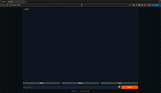

# Stock Advisory Analysis Using Large Language Models

This project leverages the power of large language models (LLMs) like OpenAI's GPT-3.5 to fine-tune and create a comprehensive stock advisory analysis system. The project encompasses data cleaning, exploratory data analysis (EDA), model training, and an interactive chatbot interface to provide detailed stock market insights and predictions.

## Table of Contents

- [Overview](#overview)
- [Installation](#installation)
- [Project Structure](#project-structure)
- [Usage](#usage)
  - [Running the Chatbot](#running-the-chatbot)
  - [Data Formation for Training](#data-formation-for-training)
  - [Data Cleaning and EDA](#data-cleaning-and-eda)
- [Scripts](#scripts)
  - [Download Data](#download-data)
  - [Preprocess Data](#preprocess-data)
  - [Train Model](#train-model)
- [License](#license)
- [Demo](#demo)

## Overview

This project aims to provide users with stock market analysis and predictions using advanced machine learning techniques. By fine-tuning large language models, we create a system that not only analyzes historical stock data but also predicts future trends and provides investment recommendations.

### Key Features

- **Fine-Tuned Language Models**: Leveraging GPT-3.5 to analyze and predict stock market trends.
- **Comprehensive Data Analysis**: Cleaning, preprocessing, and visualizing stock data.
- **Interactive Chatbot**: A user-friendly interface to interact with the model and get stock analysis and predictions.

## Installation

1. Clone the repository:
    ```bash
    git clone https://github.com/your-username/your-repository.git
    cd your-repository
    ```

2. Install the required packages:
    ```bash
    pip install -r requirements.txt
    ```

3. Set up your OpenAI API key:
    Replace `your-api-key` with your actual OpenAI API key in the scripts where `OpenAI(api_key='your-api-key')` is used.


## Usage

### Running the Chatbot

The `chatbot.py` script sets up an interactive chatbot using Gradio and OpenAI's GPT-3.5. This is the primary entry point for users to get stock analysis and predictions.

1. Run the chatbot:
    ```bash
    python chatbot.py
    ```

### Data Formation for Training

The `data_formation_for_training.py` script processes stock data, summarizes it, and prepares it for training machine learning models. This script is part of the backend data preparation process.

1. Run the data formation script:
    ```bash
    python src/data/data_formation_for_training.py
    ```

### Data Cleaning and EDA

The `Data Cleaning & EDA.ipynb` notebook includes data cleaning, exploratory data analysis, and visualization. This notebook is used for preprocessing and analyzing the data before training the models.

1. Open the notebook in Jupyter:
    ```bash
    jupyter notebook "Data Cleaning & EDA.ipynb"
    ```

## Scripts

### Download Data

The `scripts/download_data.sh` script downloads stock data using API calls. This script is used to gather raw data for analysis and training.

1. Run the script:
    ```bash
    bash scripts/download_data.sh
    ```

### Preprocess Data

The `scripts/preprocess_data.sh` script preprocesses the downloaded data for analysis. This script is used to clean and prepare the data for model training.

1. Run the script:
    ```bash
    bash scripts/preprocess_data.sh
    ```

### Train Model

The `scripts/train_model.sh` script trains the machine learning models on the preprocessed data. This script is used to build and fine-tune the predictive models.

1. Run the script:
    ```bash
    bash scripts/train_model.sh
    ```

## Demo

[Click here to watch a video demonstration of the chatbot](media/Final_project_s.mp4)



## License

This project is licensed under the MIT License - see the [LICENSE](LICENSE) file for details.


